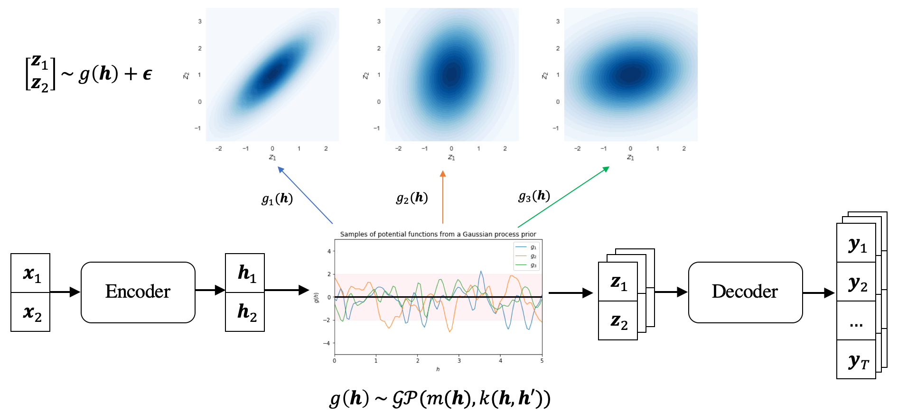

# GP-VAE

This repository provides datasets and code for preprocessing, training and testing models for the paper:

> [Diverse Text Generation via Variational Encoder-Decoder Models with Gaussian Process Priors](http://arxiv.org/abs/2204.01227) <br>
> Wanyu Du, Jianqiao Zhao, Liwei Wang and Yangfeng Ji <br>
> [ACL 2022 6th Workshop on Structured Prediction for NLP](http://structuredprediction.github.io/SPNLP22) <br>





## Installation
The following command installs all necessary packages:
```
pip install -r requirements.txt
```
The project was tested using Python 3.6.6.


## Datasets
1. **Twitter URL** includes `trn/val/tst.tsv`, which has the following format in each line:
```
source_sentence \t reference_sentence 
```

2. **GYAFC** has two sub-domains `em` and `fr`, please request and download the data from the original paper [here](https://github.com/raosudha89/GYAFC-corpushttps://github.com/raosudha89/GYAFC-corpus).


## Models

### Training 
Train the LSTM-based variational encoder-decoder with GP priors:
```
cd models/pg/
python main.py --task train --data_file ../../data/twitter_url \
			   --model_type gp_full --kernel_v 65.0 --kernel_r 0.0001
```
where `--data_file` indicates the data path for the training data, <br>
`--model_type` indicates which prior to use, including `copynet/normal/gp_full`, <br>
`--kernel_v` and `--kernel_r` specifies the hyper-parameters for the kernel of GP prior.


Train the transformer-based variational encoder-decoder with GP priors:
```
cd models/t5/
python t5_gpvae.py --task train --dataset twitter_url \
    			   --kernel_v 512.0 --kernel_r 0.001 
```
where `--data_file` indicates the data path for the training data, <br>
`--kernel_v` and `--kernel_r` specifies the hyper-parameters for the kernel of GP prior.


### Inference
Test the LSTM-based variational encoder-decoder with GP priors:
```
cd models/pg/
python main.py --task decode --data_file ../../data/twitter_url \
			   --model_type gp_full --kernel_v 65.0 --kernel_r 0.0001 \
			   --decode_from sample \
			   --model_file /path/to/best/checkpoint
```
where `--data_file` indicates the data path for the testing data, <br>
`--model_type` indicates which prior to use, including `copynet/normal/gp_full`, <br>
`--kernel_v` and `--kernel_r` specifies the hyper-parameters for the kernel of GP prior, <br>
`--decode_from` indicates generating results conditioning on z_mean or randomly sampled z, including `mean/sample`.


Test the transformer-based variational encoder-decoder with GP priors:
```
cd models/t5/
python t5_gpvae.py --task eval --dataset twitter_url \
    			   --kernel_v 512.0 --kernel_r 0.001 \
    			   --from_mean \
    			   --timestamp '2021-02-14-04-57-04' \
    			   --ckpt '30000' # load best checkpoint
```
where `--data_file` indicates the data path for the testing data, <br>
`--kernel_v` and `--kernel_r` specifies the hyper-parameters for the kernel of GP prior, <br>
`--from_mean` indicates whether to generate results conditioning on z_mean or randomly sampled z, <br>
`--timestamp` and `--ckpt` indicate the file path for the best checkpoint.


## Citation
If you find this work useful for your research, please cite our paper:

#### Diverse Text Generation via Variational Encoder-Decoder Models with Gaussian Process Priors
```
@inproceedings{du2022gpvae,
    title = "Diverse Text Generation via Variational Encoder-Decoder Models with Gaussian Process Priors",
    author = "Du, Wanyu and Zhao, Jianqiao and Wang, Liwei and Ji, Yangfeng",
    booktitle = "Proceedings of the 6th Workshop on Structured Prediction for NLP (SPNLP 2022)",
    year = "2022",
    publisher = "Association for Computational Linguistics",
}
```
